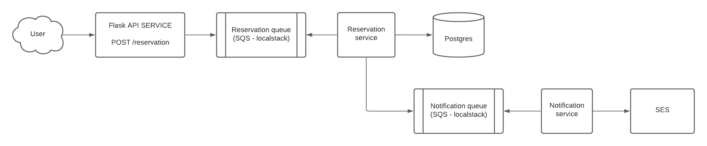

# Workplace Reservation System.

## Services description.

The purpose of this task is to become familiar with microservices architecture using queue services as well as the possibility to scale highly loaded systems.

### User Facing API. 
Service handles reservation requests. Endpoint takes reservation
Parameters. When the service receives a request, it performs validation and checking of user input parameters and if they are valid, sends an event to the `reservation` queue.
### Reservation Service. 
Check workplace availability by requested params. In case of available workplace add a record to DB with a reservation place for the requested timeslot, employee details, send `notification` event. 
Otherwise, inform the employee about the nearest available timeslots through the notification service.
### Notification Service.
The service listens to the events by `notification` queue and has a background task that sends an email to the address got from the queue.

## Requirements
- Use provided docker-compose and services example as a starting point.
- Use Python 3. 
- Amazon SQS should be used as a message bus. 
- Each service must be a separate unit with the possibility to run in its own Docker container, as all of them should starts through docker-compose.
- Amazon SES should be used for email notifications.

Please choose frameworks, databases and ORM at its discretion. Requirements with an asterisk may be skipped if time is not enough.

## Useful links:

- https://github.com/localstack/localstack
- https://aws.amazon.com/sqs/faqs/
- https://aws.amazon.com/ses/faqs/
